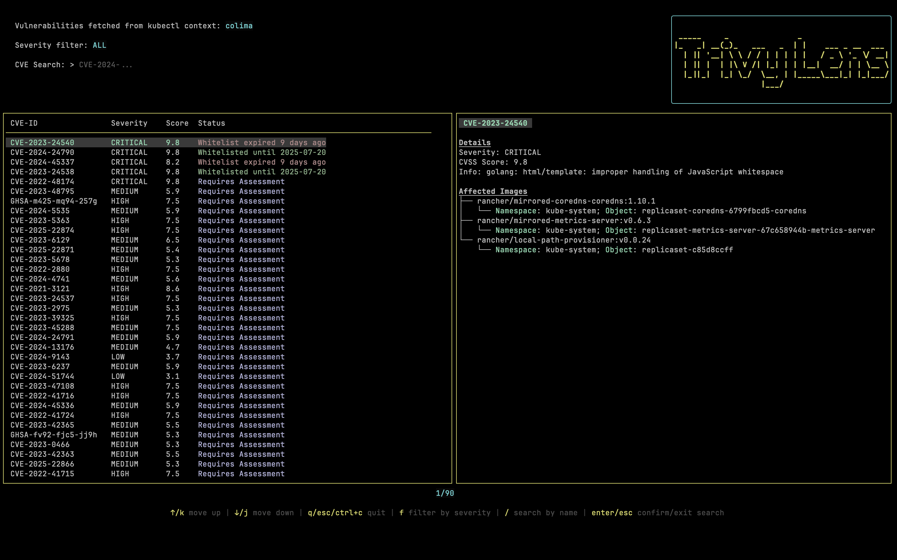
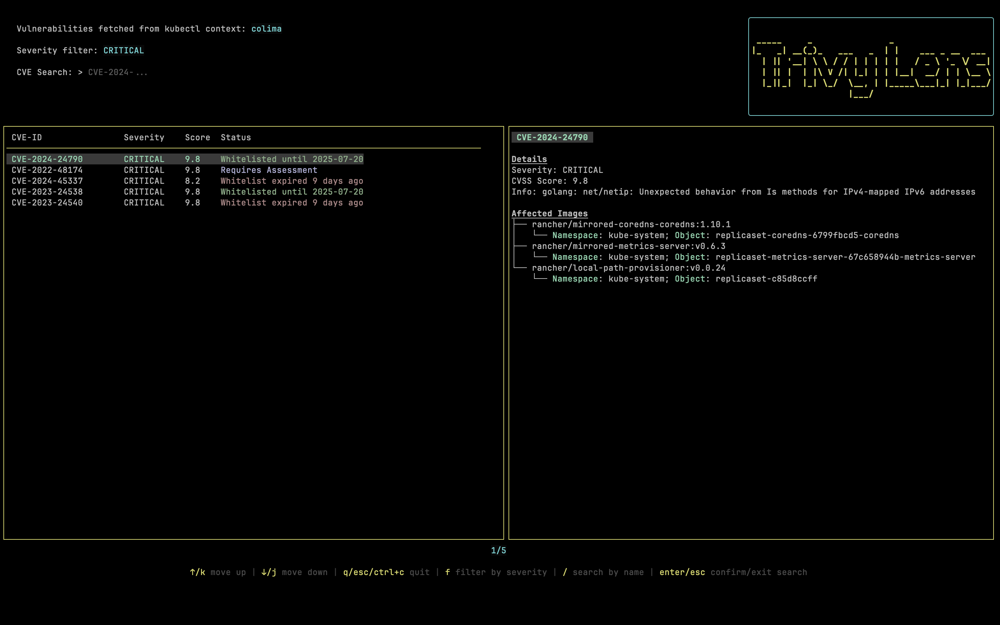
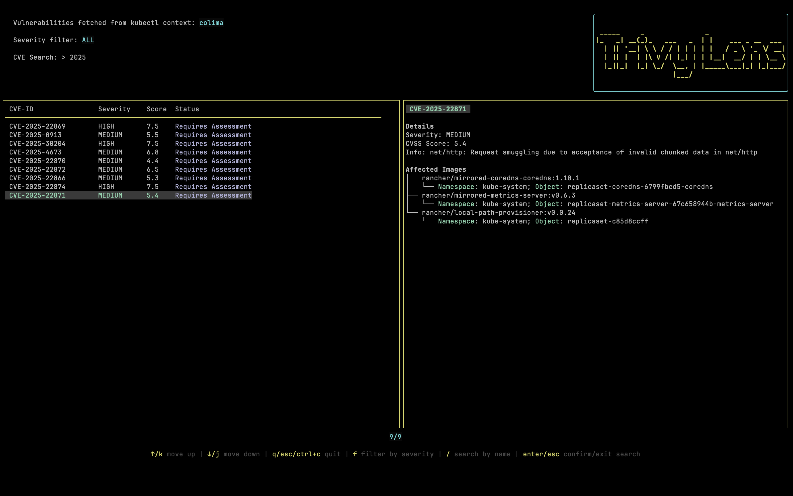

# Trivy Lens

**Trivy Lens** is a terminal UI for exploring container image [vulnerability reports] generated by [Trivy Operator].
The goal of **Trivy Lens** is to simplify the assessment of vulnerabilities in container images by providing a clear, interactive view that **correlates vulnerability reports with the whitelisted entries defined in the [ignoreFile]**.

Trivy Lens offers a convenient interface to:

- Browse vulnerability reports produced by [Trivy Operator]
- View and manage whitelisted vulnerabilities defined in the [ignoreFile]
- Filter vulnerabilities by severity
- Search for vulnerabilities by name
- Inspect detailed vulnerability metadata, affected images, and related Kubernetes objects

## How It Works

Trivy Lens connects to the Kubernetes cluster specified in the [current kubectl context].
It fetches [vulnerability reports] and the [ignoreFile] directly from the cluster.

The UI displays:

- A table listing detected vulnerabilities
- A detailed pane on the right side showing:

  - Basic CVE information
  - Affected container images
  - Associated Kubernetes objects

There are three possible states for a reported vulnerability in Trivy Lens:

- **Whitelisted until <date>**:
  The vulnerability is listed in the [ignoreFile] with a future expiry date.
  It is still shown because it was detected in images scanned before it was added to the [ignoreFile].
  It will disappear after the next scan cycle.

- **Whitelist expired <date>**:
  The vulnerability is listed in the [ignoreFile], but the expiry date has passed.
  Since the vulnerability is still being reported, action is required - either renew the whitelist or address the issue.

- **Requires Assessment**:
  The vulnerability is not included in the [ignoreFile].
  It needs to be reviewed and either remediated or explicitly whitelisted with a justification.

---

## Examples

1. Default view

2. Filter by severity

3. Filter by name

[vulnerability reports]: https://aquasecurity.github.io/trivy-operator/latest/docs/crds/vulnerability-report/
[Trivy Operator]: https://aquasecurity.github.io/trivy-operator/latest/
[ignoreFile]: https://trivy.dev/latest/docs/configuration/filtering/#by-finding-ids
[current kubectl context]: https://kubernetes.io/docs/reference/kubectl/generated/kubectl_config/kubectl_config_current-context/
